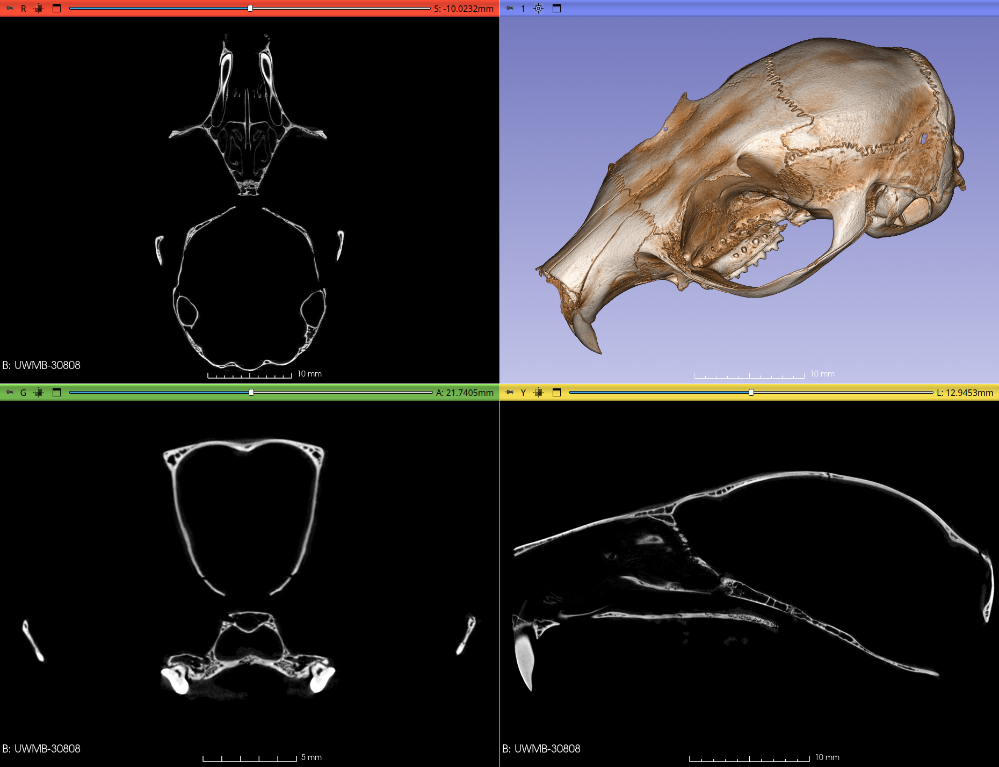

## MorphoDepot Repository
Repository for segmentation of a specimen scan.  See [this JSON file](MorphoDepotAccession.json) for specimen details.
* Species: Glaucomys sabrinus
* Accessioned specimen: UWBM:Mamm:30808 ([record](https://gbif.org/occurrence/1702669889))
* Modality: Micro CT (or synchrotron)
* Contrast: No
* Dimensions: (975, 1589, 750)
* Spacing (mm): (0.026199930000000003, 0.026199930000000003, 0.02619993)

## Screenshots

_Northern flying squirrel_
